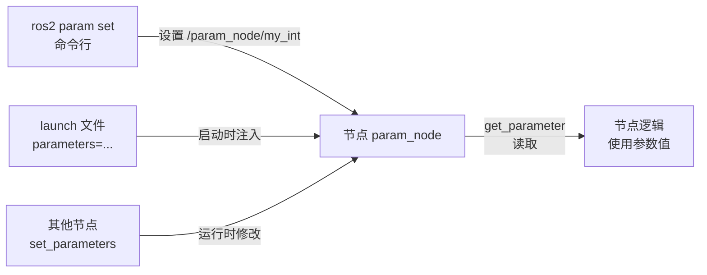

# ROS 2 参数（Parameters）— Python 教程

> ROS 2 中的 **参数（Parameters）** 是节点级的配置项，用于在**不修改代码**的情况下调整节点的行为，例如速度、频率、阈值、颜色等。本文带你理解参数的原理，并用 Python 从零写一个可声明、可读取、可动态修改参数的节点。

---

## 一、什么是 ROS 参数？

### 1.1 基本概念

- **参数（Parameter）**：附着在**某个节点**上的一个 **键值对（key-value）**，例如节点 `turtle` 上有参数 `background_r = 255`。
- 每个参数都属于某个节点，通过 **`/节点名/参数名`** 来定位，例如 `/turtle/background_r`。
- 参数由**节点自己管理**，可以设置默认值；运行中可以通过命令行、launch 文件或其他节点**动态修改**。



### 1.2 参数 vs 话题（Topic）

| 对比项 | 参数（Parameter） | 话题（Topic） |
|--------|-------------------|---------------|
| **归属** | 属于某个节点 | 不属于任何节点，全局广播 |
| **内容** | 单个键值对（配置项） | 结构化的消息流 |
| **方向** | 无方向，可读可写 | 单向：发布者 → 订阅者 |
| **用途** | 配置 / 调参 | 数据传输 / 通信 |
| **数据量** | 小，偶发改变 | 可高频、大量 |
| **修改方式** | 一次性设置即可 | 持续发布 |

> 打个比方：**参数像汽车仪表盘上的旋钮**（转速、亮度、音量……），调一次管用；**话题像电台广播**（数据流），一直在播。调参用参数，通信用话题，二者是 ROS 2 中相辅相成的两种机制。

### 1.3 参数的数据类型

| 类型 | 说明 | 示例 |
|------|------|------|
| `integer` | 整数 | `42` |
| `double` | 浮点数 | `3.14` |
| `string` | 字符串 | `"hello"` |
| `bool` | 布尔值 | `true` |
| `integer_array` | 整型数组 | `[1, 2, 3]` |
| `double_array` | 浮点数组 | `[1.5, 2.5]` |
| `string_array` | 字符串数组 | `["a", "b"]` |
| `bool_array` | 布尔数组 | `[true, false]` |

> 还有 `byte[]`（字节数组）等，但上面这 8 种是最常用的。一个参数在任意时刻**只能取一种类型**。

---

## 二、准备工作

本文基于 **ROS 2 Jazzy + Python 3**，假设你的环境已经配置好：

```bash
# 检查 ROS 2 是否可用
printenv ROS_DISTRO        # 应输出 jazzy

# 每次打开终端都要 source 环境（也可写入 ~/.bashrc）
source /opt/ros/jazzy/setup.bash
source ~/ros_ws/install/setup.bash
```

---

## 三、最小代码样例

下面是一个使用参数的完整节点：它声明了 6 个参数，每 0.5 秒读取并打印一次。

### 3.1 节点 `param_node.py`

```python
import rclpy
from rclpy.node import Node


class ParamNode(Node):
    """演示 ROS 2 参数的节点：声明参数 → 定时读取并打印。"""

    def __init__(self):
        super().__init__('param_node')

        # ---- 1. 声明参数（名字 + 默认值）----
        #    声明之后才能被 ros2 param list 看到、被命令行/launch 修改
        self.declare_parameter('my_str', 'world')      # 字符串参数，默认 'world'
        self.declare_parameter('my_int', 42)           # 整数参数，默认 42
        self.declare_parameter('my_double', 3.14)      # 浮点参数，默认 3.14
        self.declare_parameter('my_bool', True)        # 布尔参数，默认 True
        self.declare_parameter('my_array', [1, 2, 3])  # 整型数组参数，默认 [1,2,3]
        self.declare_parameter('my_enum', 'A')         # 模拟枚举：只允许 A/B/C

        # ---- 2. 定时器：每 0.5 秒读取并打印一次参数 ----
        self.timer = self.create_timer(0.5, self.timer_callback)

    def timer_callback(self):
        # get_parameter() 返回 Parameter 对象，用 .value 取实际值
        s = self.get_parameter('my_str').value
        i = self.get_parameter('my_int').value
        d = self.get_parameter('my_double').value
        b = self.get_parameter('my_bool').value
        arr = self.get_parameter('my_array').value
        e = self.get_parameter('my_enum').value
        self.get_logger().info(
            f'my_str={s} my_int={i} my_double={d} '
            f'my_bool={b} my_array={arr} my_enum={e}')


def main(args=None):
    rclpy.init(args=args)        # 1. 初始化 rclpy
    node = ParamNode()           # 2. 实例化节点（此时会声明参数）
    try:
        rclpy.spin(node)         # 3. 阻塞运行，持续处理回调
    except KeyboardInterrupt:
        pass                     # 按 Ctrl+C 静默退出
    finally:
        node.destroy_node()      # 4. 清理
        rclpy.shutdown()


if __name__ == '__main__':
    main()
```

### 3.2 代码要点解读

| 代码 | 作用 |
|------|------|
| `declare_parameter(名字, 默认值)` | **声明**一个参数并给定默认值。未声明的参数在读取时会有警告 |
| `get_parameter(名字)` | 读取参数，返回一个 `Parameter` 对象 |
| `.value` | 取出 `Parameter` 对象里的实际值（int / float / str / bool / list） |
| `create_timer(秒, 回调)` | 定时触发回调，这里用来周期性打印当前参数值 |

> **为什么要 `declare_parameter`？**
> 声明参数有两个好处：一是参数有了**默认值**（不传也能跑）；二是参数会出现在 `ros2 param list` 中，并且能被 `ros2 param set`、launch 文件合法地修改。不声明直接 `get_parameter` 会得到"未声明"的警告。

---

## 四、进阶：动态修改参数 + 合法性校验

默认情况下，`ros2 param set` 可以随意改参数值。如果想在**修改时拦截并校验**（比如枚举值只能取 A/B/C），可以用 `add_on_set_parameters_callback` 注册回调。

### 4.1 动态参数节点 `param_node_dynamic.py`

```python
import rclpy
from rclpy.node import Node
from rclpy.parameter import Parameter
from rclpy.parameters import SetParametersResult


class DynamicParamNode(Node):
    """演示动态参数修改：允许 set 的同时做合法性校验。"""

    def __init__(self):
        super().__init__('param_node_dynamic')

        self.declare_parameter('my_enum', 'A')   # 只允许 A/B/C
        self.declare_parameter('my_int', 42)     # 只允许 0~100

        # 注册"参数被修改时"的回调
        self.add_on_set_parameters_callback(self.param_callback)

        self.timer = self.create_timer(1.0, self.timer_callback)

    def param_callback(self, params):
        """每次参数被 set 时调用。返回 SetParametersResult 表示接受/拒绝。"""
        for p in params:                     # params 是一批 Parameter 对象
            if p.name == 'my_enum' and p.value not in ('A', 'B', 'C'):
                return SetParametersResult(
                    successful=False, reason='my_enum 只能是 A/B/C')
            if p.name == 'my_int' and not (0 <= p.value <= 100):
                return SetParametersResult(
                    successful=False, reason='my_int 必须在 0~100 之间')
        return SetParametersResult(successful=True)

    def timer_callback(self):
        self.get_logger().info(
            f'my_enum={self.get_parameter("my_enum").value} '
            f'my_int={self.get_parameter("my_int").value}')


def main(args=None):
    rclpy.init(args=args)
    node = DynamicParamNode()
    try:
        rclpy.spin(node)
    except KeyboardInterrupt:
        pass
    finally:
        node.destroy_node()
        rclpy.shutdown()


if __name__ == '__main__':
    main()
```

### 4.2 校验回调的返回类型

| 返回 | 含义 |
|------|------|
| `SetParametersResult(successful=True)` | 接受本次修改 |
| `SetParametersResult(successful=False, reason='...')` | 拒绝本次修改，`reason` 会反馈给调用方 |

> 注意：校验回调的参数 `params` 是一个**列表**（一次可能同时改多个参数），所以用 `for p in params` 逐个检查。只要有一个不合法，就返回 `successful=False`，整批修改都会被拒绝。

---

## 五、完整过程（从包到运行）

### 第 1 步：创建功能包

在 `src/` 下用官方命令创建 Python 包（这里包名用 `py_param` 演示，也可换成你自己的名字）：

```bash
cd ~/ros_ws/src
ros2 pkg create py_param --build-type ament_python --node-name param_node
```

`--node-name param_node` 会自动生成 `py_param/param_node.py` 并在 `setup.py` 中注册入口。

### 第 2 步：放置代码文件

把上面的代码保存为：

```
src/py_param/py_param/param_node.py          # 基础版：声明 + 读取
src/py_param/py_param/param_node_dynamic.py  # 进阶版：动态修改 + 校验
```

### 第 3 步：配置 `setup.py`

编辑 `src/py_param/setup.py`，在 `console_scripts` 中注册两个可执行入口：

```python
entry_points={
    'console_scripts': [
        'param_node = py_param.param_node:main',
        'param_node_dynamic = py_param.param_node_dynamic:main',
    ],
},
```

### 第 4 步：确认 `package.xml` 依赖

确保 `package.xml` 里声明了 `rclpy`（`ros2 pkg create` 默认已带）：

```xml
<exec_depend>rclpy</exec_depend>
```

### 第 5 步：构建

回到工作区根目录，构建这个包（**每次改代码后都要重新构建**）：

```bash
cd ~/ros_ws
colcon build --packages-select py_param
source install/setup.bash
```

### 第 6 步：运行与命令行调参

```bash
# 终端 1：启动节点
source /opt/ros/jazzy/setup.bash
source ~/ros_ws/install/setup.bash
ros2 run py_param param_node
```

```bash
# 终端 2：查看 / 修改参数
source /opt/ros/jazzy/setup.bash
source ~/ros_ws/install/setup.bash

ros2 param list /param_node           # 列出该节点的所有参数
ros2 param get /param_node my_str     # 获取单个参数值
ros2 param set /param_node my_int 100 # 动态修改参数（终端 1 会立即打印新值）
```

### 第 7 步：验证结果

- **终端 1** 会周期性打印：`my_str=world my_int=42 ...`
- 在**终端 2** 执行 `ros2 param set /param_node my_int 100` 后，终端 1 立刻变为 `my_int=100`
- 试试动态版本校验：

```bash
ros2 run py_param param_node_dynamic
# 另一个终端：
ros2 param set /param_node_dynamic my_enum X   # 会被拒绝：my_enum 只能是 A/B/C
ros2 param set /param_node_dynamic my_enum B   # 成功
ros2 param set /param_node_dynamic my_int 999  # 会被拒绝：必须在 0~100 之间
```

预期输出示例：

```text
$ ros2 param set /param_node_dynamic my_enum X
Setting parameter failed: my_enum 只能是 A/B/C
$ ros2 param set /param_node_dynamic my_enum B
Set parameter successful
```

---

## 六、在 launch 文件中使用参数

参数也可以在**启动时**通过 launch 文件注入，这样"改参数不用动代码"。

### 6.1 直接传参

```python
from launch import LaunchDescription
from launch_ros.actions import Node

def generate_launch_description():
    return LaunchDescription([
        Node(
            package='py_param',
            executable='param_node',
            # 启动时把参数注入到节点，等价于逐个 --ros-args -p
            parameters=[{
                'my_str': 'hello launch',
                'my_int': 99,
                'my_enum': 'B',
            }],
        )
    ])
```

### 6.2 从 YAML 文件加载（配合 `ros2 param dump`）

先导出节点当前参数到 YAML：

```bash
ros2 param dump /param_node            # 生成 param_node.yaml
ros2 param dump /param_node --output-dir ~/ros_ws/src/py_param/config/
```

然后在 launch 中加载该文件：

```python
from launch import LaunchDescription
from launch.actions import DeclareLaunchArgument
from launch.substitutions import PathJoinSubstitution, LaunchConfiguration
from launch_ros.actions import Node
from launch_ros.parameter_descriptions import ParameterFile

def generate_launch_description():
    # 假设 config 目录在功能包内，路径会被正确解析
    param_file = PathJoinSubstitution([
        LaunchConfiguration('param_file'),
    ])

    return LaunchDescription([
        DeclareLaunchArgument(
            'param_file',
            default_value='src/py_param/config/param_node.yaml',
            description='参数文件路径'),
        Node(
            package='py_param',
            executable='param_node',
            parameters=[ParameterFile(param_file, allow_substs=True)],
        ),
    ])
```

> `ros2 param dump` 生成的 YAML 会包含 `/**` 前缀（表示"任意命名空间下的该节点"），launch 加载时会自动套用到本节点的命名空间。

---

## 七、常用命令行速查

| 命令 | 作用 |
|------|------|
| `ros2 param list /节点名` | 列出节点的所有参数 |
| `ros2 param get /节点名 参数名` | 获取某个参数值 |
| `ros2 param set /节点名 参数名 值` | 设置某个参数值（可触发校验回调） |
| `ros2 param describe /节点名 参数名` | 查看参数类型、默认值、描述 |
| `ros2 param dump /节点名` | 把节点参数导出为 YAML 文件 |
| `ros2 param load /节点名 文件.yaml` | 从 YAML 文件批量加载参数 |
| `ros2 run 包 可执行 --ros-args -p 名:=值` | 启动时直接传参 |

---

## 八、常见问题排查

| 现象 | 原因 / 解决 |
|------|------------|
| `ros2 param list` 看不到自己声明的参数 | 忘记 `declare_parameter`，只声明了却没调用；或节点没在运行 |
| `get_parameter` 有 "undeclared parameter" 警告 | 参数未声明就读取，先用 `declare_parameter` 声明 |
| `ros2 param set` 提示找不到节点 | 参数是**属于节点的**，先确认节点在运行：`ros2 node list` |
| `ros2 param set` 修改无效 | 节点用 `add_on_set_parameters_callback` 拒绝了，或节点没读取该参数 |
| launch 里传的参数不生效 | 参数名写错，或 `parameters` 字典键名与 `declare_parameter` 的名字不一致 |
| 改了代码但行为没变 | 忘记重新构建：`colcon build --packages-select py_param` |

---

## 九、小结

- **参数**是节点级的**键值对配置**，用于在不改代码的情况下调整节点行为。
- 用 Python 只需掌握四个关键点：`declare_parameter`（声明）、`get_parameter(...).value`（读取）、`add_on_set_parameters_callback`（修改时校验）、`ros2 param set`（命令行调参）。
- 参数可以从三个入口设置：**代码默认值** → **launch 文件** → **命令行/其他节点**，后设置的会覆盖先前的。
- 完整流程：**建包 → 声明参数 → 注册入口 → 构建 → 运行 → 调参**。

掌握了参数，你就有了给节点"拧旋钮"的能力。结合之前学的**话题（Topic）**和后面的**服务（Service）**，就能搭建出灵活、可配置的机器人系统。
