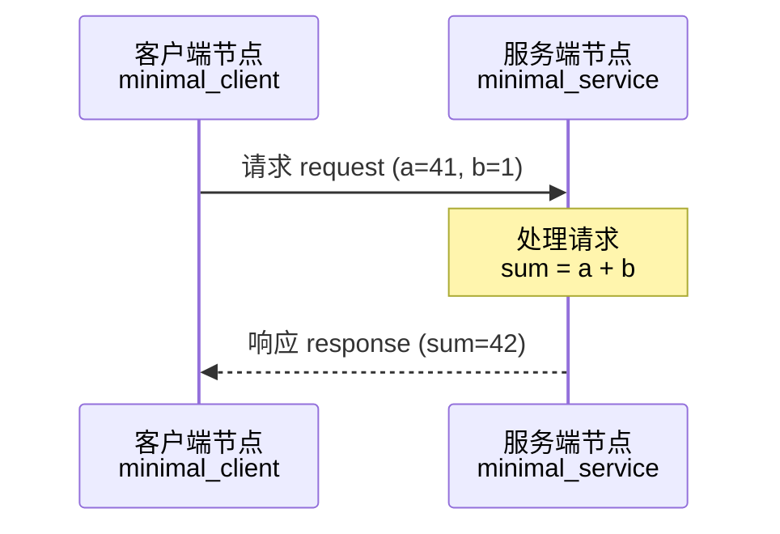

# ROS2 服务端（Service Server）与客户端（Service Client）

> ROS2 中节点间通信除了异步的 **话题（Topic）** 模式，还有一种同步的 **服务 / 客户端（Service）** 模式。本文带你理解它的原理，并用 Python 从零写出一个最小可运行的服务端与客户端。

---

## 一、什么是服务端与客户端？

在 ROS2 中，**话题**适合"一个发、多个收"的**异步**数据流；而**服务**适合"请求一次、得到一次结果"的**同步**问答式通信：

- **服务端（Service Server）**：接收客户端的请求，处理并返回响应。
- **客户端（Service Client）**：发起请求，然后**阻塞等待**服务端的响应。



这种模式的几个关键特点：

| 特点 | 说明 |
|------|------|
| **同步** | 客户端发出请求后要**等待**服务端返回结果，是"一问一答" |
| **一对一** | 一次请求对应一次响应，且同一时刻只有一个客户端能调用某个服务 |
| **有始有终** | 请求与响应各有一个类型定义（`Request` 与 `Response`），成对出现 |
| **面向调用** | 适合"查询状态、触发动作并拿结果"的场景，如让机器人做个动作、读取传感器数值 |

> 打个比方：**服务就像餐厅点餐**。你（客户端）叫来服务员下单（请求），服务员把菜做好端上来（响应），你拿到菜后才离开。而话题则像广播电台，电台只管播，听众随时听，双方互不等待。

> 何时用话题、何时用服务？**持续流动的数据**（传感器流、状态流）用话题；**"调用一次、等待结果"**（一次性查询、一次性指令）用服务。

---

## 二、准备工作

本文基于 **ROS2 Jazzy + Python 3**，假设你的环境已经配置好：

```bash
# 检查 ROS2 是否可用
printenv ROS_DISTRO        # 应输出 jazzy

# 每次打开终端都要 source 环境（也可写入 ~/.bashrc）
source /opt/ros/jazzy/setup.bash
source ~/ros_ws/install/setup.bash
```

本文使用官方标准服务接口 `example_interfaces/srv/AddTwoInts`（接收两个整数，返回它们的和），无需自定义接口，是最省事的入门方式。

---

## 三、最小代码样例

下面是最精简的服务端 / 客户端，使用标准接口 `example_interfaces/srv/AddTwoInts`，服务名为 `add_two_ints`。

### 3.1 服务端 `minimal_service.py`

```python
import rclpy                    # ROS2 Python 客户端库
from rclpy.node import Node     # 节点基类
from example_interfaces.srv import AddTwoInts  # 服务接口类型（请求/响应的数据结构）


class MinimalService(Node):
    """服务端节点：提供 add_two_ints 服务，接收两个整数，返回它们的和"""

    def __init__(self):
        super().__init__('minimal_service')          # 节点名称（ros2 node list 可见）
        self.srv = self.create_service(              # 创建服务端
            AddTwoInts,               # 服务接口类型（决定请求/响应各有哪些字段）
            'add_two_ints',           # 服务名称（客户端必须用同名调用）
            self.add_two_ints_callback)  # 收到请求时调用的回调函数

    def add_two_ints_callback(self, request, response):
        """处理请求并返回响应。
        request  是客户端发来的数据（字段 a、b）
        response 是要回传给客户端的结果（字段 sum）"""
        response.sum = request.a + request.b          # 取两个整数相加，填入响应字段
        self.get_logger().info(
            f'Incoming request: a={request.a}, b={request.b} -> sum={response.sum}')
        return response                               # 必须返回 response，否则客户端收不到结果


def main(args=None):
    rclpy.init(args=args)                 # 1. 初始化 rclpy（每个进程必须调用一次）
    node = MinimalService()               # 2. 创建服务端节点（此时服务已注册）
    rclpy.spin(node)                      # 3. 阻塞运行：一直监听并处理客户端请求
    node.destroy_node()                   # 4. 清理：销毁节点（Ctrl+C 退出后执行）
    rclpy.shutdown()


if __name__ == '__main__':
    main()
```

### 3.2 客户端 `minimal_client.py`

```python
import sys                      # 读取命令行参数
import rclpy                    # ROS2 Python 客户端库
from rclpy.node import Node     # 节点基类
from example_interfaces.srv import AddTwoInts  # 服务接口类型（请求/响应的数据结构）


class MinimalClient(Node):
    """客户端节点：调用 add_two_ints 服务，计算 a + b"""

    def __init__(self):
        super().__init__('minimal_client')           # 节点名称（ros2 node list 可见）
        self.cli = self.create_client(               # 创建客户端
            AddTwoInts,           # 服务接口类型（与服务端保持一致）
            'add_two_ints')       # 服务名称（与服务端保持一致）
        # 等待服务端就绪：每秒检查一次，没等到就一直等（先启动客户端也不会报错）
        while not self.cli.wait_for_service(timeout_sec=1.0):
            self.get_logger().info('service not available, waiting again...')

    def call_service(self, a, b):
        # 构造请求对象并给字段赋值（a、b 由调用方传入）
        req = AddTwoInts.Request()
        req.a = a
        req.b = b
        # 异步发起请求：不阻塞主线程，返回一个 Future 对象，之后轮询它是否完成
        future = self.cli.call_async(req)
        # 阻塞等待请求完成：等待期间仍会处理节点回调
        rclpy.spin_until_future_complete(self, future)
        if future.result() is not None:   # 成功拿到响应
            self.get_logger().info(
                f'Result: {req.a} + {req.b} = {future.result().sum}')
        else:                              # 调用失败（如服务端异常/超时）
            self.get_logger().error('Service call failed')


def main(args=None):
    rclpy.init(args=args)                 # 1. 初始化 rclpy
    # 2. 解析命令行参数：a、b 取 sys.argv 前两个位置参数（缺省为 0）
    a = int(sys.argv[1]) if len(sys.argv) > 1 else 0
    b = int(sys.argv[2]) if len(sys.argv) > 2 else 0
    node = MinimalClient()                # 3. 创建客户端节点（内部已等待服务就绪）
    node.call_service(a, b)               # 4. 发起调用并打印结果
    node.destroy_node()                   # 5. 清理
    rclpy.shutdown()


if __name__ == '__main__':
    main()
```

### 3.3 代码要点解读

| 代码 | 作用 |
|------|------|
| `rclpy.init()` | 初始化 ROS2 客户端库，**每个进程必须调用一次** |
| `create_service(Type, name, cb)` | 创建服务端：接口类型 / 服务名 / 回调。回调返回 `response` |
| `create_client(Type, name)` | 创建客户端：接口类型 / 服务名 |
| `wait_for_service(秒)` | 阻塞等待服务端上线，返回 `bool`，用于客户端先于服务端启动的场景 |
| `AddTwoInts.Request()` | 构造请求对象，为其字段（`a`、`b`）赋值（值来自命令行参数） |
| `call_async(req)` | 异步发起请求，返回一个 `Future` 对象 |
| `spin_until_future_complete(node, future)` | 在等待期间处理节点回调，直到请求完成；也可用 `future.result()` 拿结果 |

> **为什么回调要 `return response`？** 服务端回调的签名固定为 `(request, response) -> response`。你在回调里修改 `response` 的字段，最后**必须把它返回**，ROS2 才会把结果送回客户端。

> **`call_async` 是异步的**：它不会阻塞主线程，而是返回 `Future`。用 `rclpy.spin_until_future_complete()` 或 `rclpy.spin_once()` + `future.done()` 来等待完成，这样节点在等待期间仍能处理其他回调。

---

## 四、完整过程（从包到运行）

### 第 1 步：创建功能包

在 `src/` 下用官方命令创建 Python 包（这里包名用 `py_service` 演示，也可换成你自己的名字）：

```bash
cd ~/ros_ws/src
ros2 pkg create py_service --build-type ament_python --node-name service
```

`--node-name service` 会自动生成 `py_service/service.py` 并在 `setup.py` 中注册入口。

### 第 2 步：放置代码文件

把上面两段代码分别保存为：

```
src/py_service/py_service/service.py     # 服务端
src/py_service/py_service/client.py      # 客户端
```

（也可以直接使用官方样例生成的 `service_member_function.py` / `client_member_function.py`，本文为你手写的是更精简的版本。）

### 第 3 步：配置 `setup.py`

编辑 `src/py_service/setup.py`，在 `console_scripts` 中注册两个可执行入口：

```python
entry_points={
    'console_scripts': [
        'service = py_service.service:main',
        'client = py_service.client:main',
    ],
},
```

格式为：`命令名 = 模块路径:函数名`。这样构建后就能用 `ros2 run py_service service` 直接启动。

### 第 4 步：确认 `package.xml` 依赖

确保 `package.xml` 里声明了 `rclpy` 和 `example_interfaces`（`ros2 pkg create` 默认已带 `rclpy`，需手动补充 `example_interfaces`）：

```xml
<exec_depend>rclpy</exec_depend>
<exec_depend>example_interfaces</exec_depend>
```

### 第 5 步：构建

回到工作区根目录，构建这个包（**每次改代码后都要重新构建**）：

```bash
cd ~/ros_ws
colcon build --packages-select py_service
source install/setup.bash
```

### 第 6 步：运行

开**两个终端**，**先启动服务端，再启动客户端**（客户端会等待服务端就绪，所以顺序颠倒也不会报错）：

```bash
# 终端 1：服务端
source /opt/ros/jazzy/setup.bash
source ~/ros_ws/install/setup.bash
ros2 run py_service service
```

```bash
# 终端 2：客户端（在命令末尾带上 a、b 两个整数参数，如 41 1）
source /opt/ros/jazzy/setup.bash
source ~/ros_ws/install/setup.bash
ros2 run py_service client 41 1
```

### 第 7 步：验证结果

- **客户端终端**会打印：`Result: 41 + 1 = 42`，随后退出（`a`、`b` 取自命令行参数；不传参时默认为 `0`，会打印 `Result: 0 + 0 = 0`）。
- **服务端终端**会打印：`Incoming request: a=41, b=1 -> sum=42`。
- 另开一个终端可以查看服务与节点信息：

```bash
ros2 service list           # 查看所有服务，应包含 /add_two_ints
ros2 service type /add_two_ints   # 查看服务类型：example_interfaces/srv/AddTwoInts
ros2 node list              # 查看节点：/minimal_service /minimal_client
```

- 也可以不写客户端，直接**从命令行调用服务**测试服务端：

```bash
ros2 service call /add_two_ints example_interfaces/srv/AddTwoInts "{a: 5, b: 7}"
```

预期输出示例：

```text
$ ros2 service call /add_two_ints example_interfaces/srv/AddTwoInts "{a: 5, b: 7}"
requester: making request: example_interfaces.srv.AddTwoInts_Request(a=5, b=7)

response:
example_interfaces.srv.AddTwoInts_Response(sum=12)
```

---

## 五、常见问题排查

| 现象 | 原因 / 解决 |
|------|------------|
| `ros2 run` 提示找不到包 | 没 source 工作区：`source ~/ros_ws/install/setup.bash` |
| `ros2 run` 提示找不到可执行文件 | `setup.py` 的 `console_scripts` 没注册，或改后没重新 `colcon build` |
| 客户端一直打印 "service not available" | 服务端没启动，或服务名不一致（两边必须都是 `add_two_ints`） |
| `future.result()` 为 `None` | 服务端崩溃或调用超时，客户端会进入 `else` 分支打印 `Service call failed` |
| 服务端回调没返回 `response` | 回调必须 `return response`，否则客户端收不到结果、会一直卡住 |
| 改了代码但行为没变 | 忘记重新构建：`colcon build --packages-select py_service` |

---

## 六、小结

- **服务端 / 客户端**是 ROS2 中"一问一答"的**同步**通信模式，通过**服务名 + 服务接口（srv）**关联，适合一次性调用拿结果的场景。
- 用 Python 只需掌握 `create_service` / `create_client`、`wait_for_service`、`call_async` + `spin_until_future_complete` 几个关键点。
- 完整流程：**建包 → 写代码 → 注册入口 → 补充依赖 → 构建 → 运行**，每一步缺一不可。
- 本文使用现成的 `AddTwoInts` 接口。当你要传递**自己的数据结构**时，需要自定义 `.srv` 文件（格式为 `请求字段` + `---` + `响应字段`）并在 `package.xml` 中添加 `rosidl_default_generators` 等依赖，这部分可以留待进阶文章展开。

掌握了 Service，你就掌握了 ROS2 里"同步调用"的通信方式；它与前面学的 Pub/Sub（异步）、以及后续要学的 Action（长耗时任务）一起，构成了 ROS2 节点通信的三大核心模式。
