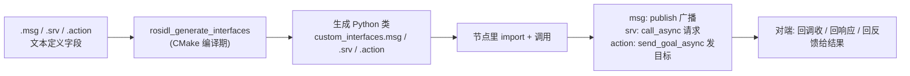

# ROS 2 自定义接口（msg / srv / action）最小可运行案例（Python）

> 一句话目标：**用 `ros2 pkg create` 创建一个包，里面同时定义 `.msg`、`.srv` 和 `.action` 三种自定义接口，并各给出一个最小的 Python 收发案例。**
>
> 行文顺序：先讲清三个概念（第一节），再定义接口（第三、四、九节），最后写节点（第七、八、九节）。

---

## 一、什么是 msg、srv 和 action（前置知识）

在动手之前，先搞清楚三个概念：`.msg`、`.srv` 和 `.action` 到底是什么、用来干什么。

### 1.1 什么是 msg（消息）

- **msg = message（消息）**，定义节点之间「发布 / 订阅」通信的**数据格式**。
- 本质：一份数据结构的"契约"——规定一条消息里有哪些字段、每个字段是什么类型。
- 文件扩展名 `.msg`，放在包的 `msg/` 目录。
- 编译后，rosidl 会按它自动生成对应语言的类（本教程是 Python 类，如 `AddressBook`），代码里 `from custom_interfaces.msg import AddressBook` 后，直接实例化、给字段赋值、`publish()` 即可。
- **通信模型**：发布者（publisher）把消息发到某个「话题（topic）」，订阅者（subscriber）从话题收。特点是**单向、松耦合、可一对多**（多个订阅者同时收）。

### 1.2 什么是 srv（服务）

- **srv = service（服务）**，定义节点之间「请求 / 响应」通信的**数据格式**。
- 本质：一次"一问一答"的契约，分为两部分：
  - **请求（Request）**：客户端 → 服务端，要什么；
  - **响应（Response）**：服务端 → 客户端，回什么。
- 文件扩展名 `.srv`，放在包的 `srv/` 目录，中间用一行 `---` 把请求和响应隔开。
- 编译后生成两个类：`X.Request` 和 `X.Response`（本教程是 `AddTwoInts.Request` / `AddTwoInts.Response`）。
- **通信模型**：服务端（server）对外提供「服务」，客户端（client）发请求后**等待**并拿到响应。特点是**双向、一问一答、同步完成**。

### 1.3 什么是 action（动作）

- **action**，定义节点之间「目标 / 反馈 / 结果」通信的**数据格式**。
- 本质：srv 的"超级版"——服务只能一问一答，action 则服务于**耗时长的任务**：客户端下发一个**目标（Goal）**，执行端一边干活一边回传**反馈（Feedback）**，干完再给最终**结果（Result）**。
- 文件扩展名 `.action`，放在包的 `action/` 目录，用**两个**孤立的 `---` 分三段（所以文件里共有**三个** `---`）：
  - `---` 之前：Goal（目标），客户端下达什么；
  - 两个 `---` 之间：Result（结果），完成后返回什么；
  - 第二个 `---` 之后：Feedback（反馈），过程中实时回传什么。
- 编译后生成三个类：`X.Goal`、`X.Result`、`X.Feedback`。
- **通信模型**：action 客户端（如导航指令）与 action 服务端（如导航执行器）之间，经历"接受目标 → 边执行边反馈 → 完成给结果"的完整过程。特点是**双向、有过程反馈、异步长任务**。

> 形象记忆：
> - msg 是「**广播数据**」（如传感器每秒刷一次）；
> - srv 是「**一问一答**」（如"2 + 3 等于几？"秒回）；
> - action 是「**派活 + 边干边汇报 + 干完交差**」（如"把机器人开到 A 点"，一路报"正在走、还剩 X 米"，到了说"已到达"）。

### 1.4 msg / srv / action 直观对比

| 维度 | msg（消息） | srv（服务） | action（动作） |
|---|---|---|---|
| 全称 | message | service | action |
| 通信模型 | 发布 / 订阅 | 请求 / 响应 | 目标 / 反馈 / 结果 |
| 方向 | 单向流 | 双向一问一答 | 双向、带过程反馈 |
| 文件分隔符 | 无 | 一行 `---` | 两个 `---`（三段） |
| 生成的 Python 类 | 消息类本身 | `X.Request` + `X.Response` | `X.Goal` / `X.Result` / `X.Feedback` |
| 节点端 API | `create_publisher` / `create_subscription` | `create_service` / `create_client` | `ActionServer` / `ActionClient` |
| 典型场景 | 传感器数据流 | 查询 / 计算（如加两个数） | 移动到位、机械臂抓取（长任务） |

> 一句话记忆：**msg 是"广播数据"，srv 是"一问一答"，action 是"带进度反馈的长任务"。**

### 1.5 msg / srv / action 是如何调用的？

下面先讲清"调用套路"，完整代码见本教程第七、八、九节，对照着看就一目了然。

#### ① 调用 msg：发布端"填字段 → 发"，订阅端"回调里收"

**发布端（三步）**

```python
self.publisher = self.create_publisher(AddressBook, 'address_book', 10)  # ① 声明类型 + 话题
msg = AddressBook()                        # ② 实例化消息对象
msg.first_name = 'John'                    #    给字段赋值
msg.phone_type = AddressBook.PHONE_TYPE_MOBILE   # 常量用类名引用
self.publisher.publish(msg)                # ③ 发布
```

**订阅端（两步）**

```python
self.create_subscription(AddressBook, 'address_book', self.callback, 10)  # ① 订阅

def callback(self, msg):                   # ② 回调里直接读字段
    print(msg.first_name, msg.phone_type)
```

#### ② 调用 srv：客户端"填请求 → 异步发"，服务端"回调里算 → 回响应"

**服务端（两步）**

```python
self.srv = self.create_service(AddTwoInts, 'add_two_ints', self.callback)  # ① 声明服务

def callback(self, request, response):     # ② 读请求、填响应、return
    response.sum = request.a + request.b
    return response
```

**客户端（三步）**

```python
self.cli = self.create_client(AddTwoInts, 'add_two_ints')      # ① 创建客户端
while not self.cli.wait_for_service(timeout_sec=1.0): ...       #    等服务端上线
req = AddTwoInts.Request()                                      # ② 构造请求对象
req.a = 2
req.b = 3                                                       #    填请求字段
future = self.cli.call_async(req)                               # ③ 异步发送
rclpy.spin_once(self)                                           #    轮询等结果
response = future.result()                                      #    拿响应 response.sum
```

#### ③ 调用 action：客户端"发目标 → 等接受 → 拿结果"，服务端"接受 → 边反馈边执行 → 给结果"

**服务端（三步）**

```python
from rclpy.action import ActionServer                     # 导入 action 专用 API

self.action_server = ActionServer(                        # ① 声明动作（目标回调去接受 / 执行）
    self, Fibonacci, 'fibonacci', self.execute_callback)  #    三个参数：类型、动作名、回调

def execute_callback(self, goal_handle):                  # ② 处理目标、循环回传反馈
    goal_handle.publish_feedback(feedback)                #    执行中实时发 Feedback
    goal_handle.succeed()                                 #    标记成功 / 失败
    return result                                         # ③ return 最终 Result
```

**客户端（三步）**

```python
self.action_client = ActionClient(self, Fibonacci, 'fibonacci')   # ① 创建动作客户端
self.action_client.wait_for_server()                              #    等服务端上线

goal_msg = Fibonacci.Goal()                                       # ② 构造目标对象
goal_msg.order = 5

future = self.action_client.send_goal_async(                      # ③ 异步发目标
    goal_msg, feedback_callback=self.on_feedback)                 #    注册"反馈"回调

rclpy.spin_until_future_complete(self, future)                    #    先等「目标是否被接受」
goal_handle = future.result()
if goal_handle.accepted:
    result_future = goal_handle.get_result_async()                #    接受后再等「最终结果」
    rclpy.spin_until_future_complete(self, result_future)
    result = result_future.result().result
```

#### ④ 关键：接口的字段从哪来？（`request.a` / `response.sum` / `goal.order` 的来源）

在代码里访问 `request.a`、`response.sum`、`msg.first_name`、`goal.order` 时，**字段名不是随便起的，而是由接口文件严格定义的**。

以 `srv/AddTwoInts.srv` 为例：

```text
int64 a
int64 b
---
int64 sum
```

- `---` **上面**是请求字段 → `Request` 对象有 `a`、`b`
- `---` **下面**是响应字段 → `Response` 对象有 `sum`

字段名是**硬绑定**的，用别的会报错：

```python
response.sum = request.a + request.b   # ✅ a、b、sum 都是 srv 里定义的
response.sum = request.x + request.y   # ❌ AttributeError: no attribute 'x'
```

> - 想用别的字段名怎么办？→ 改自己的接口文件（本教程第三、四、九节）。
> - 不确定某个接口有哪些字段？→ `ros2 interface show` 直接打印。

action 同理，三段分别对应 `Fibonacci.Goal` / `Fibonacci.Result` / `Fibonacci.Feedback`：

```python
goal_msg.order = 5                       # Goal 段字段：order
result.sequence = ...                    # Result 段字段：sequence
feedback.partial_sequence = ...          # Feedback 段字段：partial_sequence
```

#### ⑤ 完整调用链路



### 1.6 环境信息

- ROS 2 发行版：Jazzy（`/opt/ros/jazzy`）
- 工作空间：`~/ros_ws`
- 💡 **小提示**：如果运行节点或 `ros2 topic echo` 时发现话题 / 服务搜不到，多半是所处 WiFi 环境的组播发现被拦截了，可以在运行前先限定为本机发现：

```bash
export ROS_AUTOMATIC_DISCOVERY_RANGE=LOCALHOST
```

### 1.7 为什么自定义接口的包必须用 `ament_cmake` 构建？

| 构建方式 | 能否定义接口 | 说明 |
|---|---|---|
| `ament_python` | ❌ 不能 | 只能写 Python 节点，它不会调用 rosidl 生成器 |
| `ament_cmake` | ✅ 能 | `rosidl_generate_interfaces` 只能在 CMake 包中使用 |

所以接口包**必须**是 `ament_cmake`，哪怕里面全是 Python 代码（本案例即是如此）。

> `.msg` / `.srv` / `.action` 三种接口**都要走 `rosidl_generate_interfaces` 生成**，因此定义 action 的包同样是 `ament_cmake`（参见 9.2 在 CMakeLists 里加 `.action`）。

> 补课：`ament_cmake_python` 不是构建类型（它不是 `--build-type` 的可选项），而是 ament_cmake 的一个扩展，提供 `ament_python_install_package()` 等函数，用得不多，本教程不使用它。

---

## 二、用 `ros2 pkg create` 创建包

```bash
cd ~/ros_ws/src
ros2 pkg create --build-type ament_cmake --license Apache-2.0 custom_interfaces
```

生成骨架：

```
custom_interfaces/
├── CMakeLists.txt
├── package.xml
├── LICENSE
├── include/custom_interfaces/   # 本案例不需要，可删除
└── src/                         # 本案例不需要，可删除
```

接着手工创建接口与脚本目录：

```bash
cd custom_interfaces
mkdir msg srv scripts launch
rm -rf include src
```

---

## 三、定义 `.msg` 接口（消息）

文件：`msg/AddressBook.msg`

```text
# 常量：类型 名字 = 值（用大写表示，属于消息类）
uint8 PHONE_TYPE_HOME=0
uint8 PHONE_TYPE_WORK=1
uint8 PHONE_TYPE_MOBILE=2

# 字段：类型 名字
string first_name
string last_name
string phone_number
uint8 phone_type
```

**字段类型速查（常用）**：

| 类型 | 说明 |
|---|---|
| `bool` / `byte` / `int8`~`int64` / `uint8`~`uint64` | 基本数值 |
| `float32` / `float64` | 浮点 |
| `string` | 字符串 |
| 其他消息类型（如 `std_msgs/Header`） | 嵌套 |
| `Type[]` 或 `Type[N]` | 数组 / 定长数组 |

---

## 四、定义 `.srv` 接口（服务）

文件：`srv/AddTwoInts.srv`

```text
# ==== `---` 上面是请求（Request）字段 ====
int64 a
int64 b
---
# ==== `---` 下面是响应（Response）字段 ====
int64 sum
```

> 关键：`.srv` 里**必须有一个孤立的 `---`** 把请求和响应隔开；生成的 Python 类分别是 `AddTwoInts.Request` 和 `AddTwoInts.Response`。

---

## 五、配置 CMakeLists.txt（核心）

```cmake
cmake_minimum_required(VERSION 3.8)
project(custom_interfaces)

find_package(ament_cmake REQUIRED)                  # 构建工具
find_package(rosidl_default_generators REQUIRED)    # 接口代码生成器

# 声明并生成接口（msg / srv / action 一起列出）
rosidl_generate_interfaces(${PROJECT_NAME}
  "msg/AddressBook.msg"
  "srv/AddTwoInts.srv"
  "action/Fibonacci.action"
)

# 导出接口运行时依赖（供别的包使用）
ament_export_dependencies(rosidl_default_runtime)

# 安装 Python 脚本
install(PROGRAMS
  scripts/publish_address_book.py
  scripts/subscribe_address_book.py
  scripts/add_two_ints_server.py
  scripts/add_two_ints_client.py
  DESTINATION lib/${PROJECT_NAME})

# 安装 launch 文件
install(DIRECTORY launch
  DESTINATION share/${PROJECT_NAME})

if(BUILD_TESTING)
  # pkg create 自动生成，保留即可
endif()

ament_package()
```

**核心要点只有一句**：`rosidl_generate_interfaces(${PROJECT_NAME} <接口文件>)`。它会自动生成 Python / C++ 等所有语言的消息代码。

> 这里把三种接口一次性都列上了，其中 `action/Fibonacci.action` 文件要到 9.1 节才创建。如果你只想先跑 msg / srv 两个案例，可以先去掉这一行，等学到第九节再加上。

---

## 六、配置 package.xml

```xml
<package format="3">
  <name>custom_interfaces</name>
  <version>0.0.0</version>
  <description>同时定义 msg、srv 与 action 接口的 Python 最小示例包</description>
  <maintainer email="your_email@example.com">your_name</maintainer>
  <license>Apache-2.0</license>

  <buildtool_depend>ament_cmake</buildtool_depend>                 <!-- 构建工具 -->
  <buildtool_depend>rosidl_default_generators</buildtool_depend>   <!-- 接口生成器 -->
  <exec_depend>rosidl_default_runtime</exec_depend>                <!-- 接口运行时 -->
  <exec_depend>rclpy</exec_depend>                                 <!-- Python 节点 -->
  <member_of_group>rosidl_interface_packages</member_of_group>     <!-- 接口包分组 -->

  <test_depend>ament_lint_auto</test_depend>
  <test_depend>ament_lint_common</test_depend>

  <export>
    <build_type>ament_cmake</build_type>
  </export>
</package>
```

依赖项缺一不可：

| 标签 | 作用 |
|---|---|
| `buildtool_depend: ament_cmake` | 构建工具 |
| `buildtool_depend: rosidl_default_generators` | 接口生成器 |
| `exec_depend: rosidl_default_runtime` | 运行期加载接口 |
| `exec_depend: rclpy` | Python 客户端库 |
| `member_of_group: rosidl_interface_packages` | 声明"我是接口包" |

---

## 七、案例一：消息 pub / sub（Python）

### 7.1 发布者 `scripts/publish_address_book.py`

```python
#!/usr/bin/env python3
import rclpy
from rclpy.node import Node
from custom_interfaces.msg import AddressBook   # 由 .msg 生成的类型


class AddressBookPublisher(Node):
    def __init__(self):
        super().__init__('address_book_publisher')
        # create_publisher(消息类型, 话题名, 队列长度)
        self.publisher = self.create_publisher(AddressBook, 'address_book', 10)
        timer_period = 1.0   # 每 1 秒发一次
        self.timer = self.create_timer(timer_period, self.timer_callback)

    def timer_callback(self):
        msg = AddressBook()   # 直接实例化消息对象
        msg.first_name = 'John'
        msg.last_name = 'Doe'
        msg.phone_number = '1234567890'
        msg.phone_type = AddressBook.PHONE_TYPE_MOBILE   # 常量用类名引用
        self.publisher.publish(msg)
        self.get_logger().info('Publishing Contact\nFirst:%s Last:%s'
                               % (msg.first_name, msg.last_name))


def main(args=None):
    rclpy.init(args=args)
    node = AddressBookPublisher()
    rclpy.spin(node)
    node.destroy_node()
    rclpy.shutdown()


if __name__ == '__main__':
    main()
```

### 7.2 订阅者 `scripts/subscribe_address_book.py`

```python
#!/usr/bin/env python3
import rclpy
from rclpy.node import Node
from custom_interfaces.msg import AddressBook


class AddressBookSubscriber(Node):
    def __init__(self):
        super().__init__('address_book_subscriber')
        # create_subscription(消息类型, 话题名, 回调, 队列长度)
        self.subscription = self.create_subscription(
            AddressBook, 'address_book', self.listener_callback, 10)

    def listener_callback(self, msg):
        self.get_logger().info(
            'I heard:\n  First:%s Last:%s\n  Phone:%s Type:%s'
            % (msg.first_name, msg.last_name,
               msg.phone_number, msg.phone_type))


def main(args=None):
    rclpy.init(args=args)
    node = AddressBookSubscriber()
    rclpy.spin(node)
    node.destroy_node()
    rclpy.shutdown()


if __name__ == '__main__':
    main()
```

---

## 八、案例二：服务 server / client（Python）

### 8.1 服务端 `scripts/add_two_ints_server.py`

```python
#!/usr/bin/env python3
import rclpy
from rclpy.node import Node
from custom_interfaces.srv import AddTwoInts   # 生成的服务类型


class AddTwoIntsServer(Node):
    def __init__(self):
        super().__init__('add_two_ints_server')
        # create_service(服务类型, 服务名, 回调)
        self.srv = self.create_service(
            AddTwoInts, 'add_two_ints', self.add_two_ints_callback)

    def add_two_ints_callback(self, request, response):
        # request.a / request.b 是请求字段
        response.sum = request.a + request.b   # 填响应字段
        self.get_logger().info(
            'Incoming request\na: %d  b: %d' % (request.a, request.b))
        return response


def main(args=None):
    rclpy.init(args=args)
    node = AddTwoIntsServer()
    rclpy.spin(node)
    node.destroy_node()
    rclpy.shutdown()
```

### 8.2 客户端 `scripts/add_two_ints_client.py`

```python
#!/usr/bin/env python3
import sys
import rclpy
from rclpy.node import Node
from custom_interfaces.srv import AddTwoInts


class AddTwoIntsClient(Node):
    def __init__(self):
        super().__init__('add_two_ints_client')
        self.cli = self.create_client(AddTwoInts, 'add_two_ints')
        # 等待服务端上线
        while not self.cli.wait_for_service(timeout_sec=1.0):
            self.get_logger().info('service not available, waiting again...')
        self.req = AddTwoInts.Request()

    def send_request(self, a, b):
        self.req.a = a
        self.req.b = b
        return self.cli.call_async(self.req)   # 异步调用，返回 future


def main(args=None):
    rclpy.init(args=args)
    client = AddTwoIntsClient()
    a = int(sys.argv[1]) if len(sys.argv) > 1 else 2
    b = int(sys.argv[2]) if len(sys.argv) > 2 else 3
    future = client.send_request(a, b)
    while rclpy.ok():
        rclpy.spin_once(client)
        if future.done():
            try:
                response = future.result()
                print('%d + %d = %d' % (a, b, response.sum))
            except Exception as e:
                print('Service call failed: %r' % e)
            break
    client.destroy_node()
    rclpy.shutdown()
```

---

## 九、案例三：action 服务端 / 客户端（Python）

> `.msg` 是"广播数据"，`.srv` 是"一问一答"，`.action` 则是"**带过程反馈的长任务**"——下发目标、边干边反馈进度、最后给结果。适合导航、机械臂抓取这类耗时动作。

### 9.1 定义 `.action` 接口（动作）

`.action` 文件放在包根目录的 `action/` 子目录（不是 `msg/` 或 `srv/`），用**三个**孤立 `---` 把内容分成三段，从上到下依次是 **Goal（目标）/ Result（结果）/ Feedback（反馈）**。

文件：`action/Fibonacci.action`

```text
# ===== 第 1 段：Goal（目标）——客户端下达的目标 =====
int32 order

---
# ===== 第 2 段：Result（结果）——动作完成后的最终结果 =====
int32[] sequence

---
# ===== 第 3 段：Feedback（反馈）——执行过程中的阶段性信息 =====
int32[] partial_sequence
```

> 关键认知（对应第十二节的对比表）：
> - `.action` 用**三个** `---`（生成 `X.Goal` / `X.Result` / `X.Feedback` 三类）；
> - 它是 `srv` 的「超级版」：Goal 段相当于请求、Result 段相当于响应，额外多一个 Feedback 段实时回传进度；
> - 底层实现上，ROS 2 会把一个 `.action` 自动展开成 **3 个 topic + 2 个 service**（见 9.5），但写代码时你无需关心这些细节。

### 9.2 在 `CMakeLists.txt` 里加上 `.action`

在第五节的 `rosidl_generate_interfaces(...)` 里，把 `.action` 和 `.msg` / `.srv` 一起列出即可：

```cmake
rosidl_generate_interfaces(${PROJECT_NAME}
  "msg/AddressBook.msg"
  "srv/AddTwoInts.srv"
  "action/Fibonacci.action"            # ← 新增 action 接口
)
```

> 只要配置文件里同时有 `.msg` / `.srv` / `.action`，rosidl 会把 `Fibonacci` 的生成代码统一处理，生成 Python 类：`Fibonacci.Goal` / `Fibonacci.Result` / `Fibonacci.Feedback`。
> （`rclpy` 里 action 相关的 `ActionServer` / `ActionClient` API 来自 `rclpy.action`。）

### 9.3 服务端 `scripts/fibonacci_action_server.py`

```python
#!/usr/bin/env python3
import rclpy
from rclpy.node import Node
from rclpy.action import ActionServer
from custom_interfaces.action import Fibonacci   # 由 .action 生成


class FibonacciActionServer(Node):
    def __init__(self):
        super().__init__('fibonacci_action_server')
        # create_server(动作类型, 动作名, 目标回调)
        # 与 srv 不同：action 用「目标回调」先接受 / 拒绝目标，
        # 并在执行中通过 goal_handle.publish_feedback() 回传反馈
        self._action_server = ActionServer(
            self, Fibonacci, 'fibonacci', self.execute_callback)

    def execute_callback(self, goal_handle):
        self.get_logger().info('Executing goal %d' % goal_handle.request.order)
        feedback_msg = Fibonacci.Feedback()
        feedback_msg.partial_sequence = [0, 1]

        for i in range(2, goal_handle.request.order + 1):
            feedback_msg.partial_sequence.append(
                feedback_msg.partial_sequence[-1] + feedback_msg.partial_sequence[-2])
            goal_handle.publish_feedback(feedback_msg)   # 边算边回传反馈

        goal_handle.succeed()                            # 标记成功
        result = Fibonacci.Result()
        result.sequence = feedback_msg.partial_sequence  # 填结果
        return result


def main(args=None):
    rclpy.init(args=args)
    node = FibonacciActionServer()
    rclpy.spin(node)
    node.destroy_node()
    rclpy.shutdown()


if __name__ == '__main__':
    main()
```

### 9.4 客户端 `scripts/fibonacci_action_client.py`

```python
#!/usr/bin/env python3
import sys
import rclpy
from rclpy.node import Node
from rclpy.action import ActionClient
from custom_interfaces.action import Fibonacci


class FibonacciActionClient(Node):
    def __init__(self):
        super().__init__('fibonacci_action_client')
        self._action_client = ActionClient(self, Fibonacci, 'fibonacci')

    def send_goal(self, order):
        # 与服务端同理：先等服务上线，再发 goal
        self._action_client.wait_for_server()
        goal_msg = Fibonacci.Goal()       # 填目标段字段
        goal_msg.order = order
        future = self._action_client.send_goal_async(
            goal_msg, feedback_callback=self.feedback_callback)   # 注册反馈回调
        return future

    def feedback_callback(self, feedback_msg):
        # 执行过程中实时收到反馈
        partial = feedback_msg.feedback.partial_sequence
        self.get_logger().info('Feedback: %s' % partial)


def main(args=None):
    rclpy.init(args=args)
    client = FibonacciActionClient()
    order = int(sys.argv[1]) if len(sys.argv) > 1 else 5
    goal_future = client.send_goal(order)

    # send_goal_async 先返回「接受目标」的 future，要先等它成功
    rclpy.spin_until_future_complete(client, goal_future)
    goal_handle = goal_future.result()

    if not goal_handle.accepted:
        client.get_logger().info('Goal rejected')
        return

    # 目标被接受后，再等「最终结果」的 future
    result_future = goal_handle.get_result_async()
    rclpy.spin_until_future_complete(client, result_future)
    result = result_future.result()
    print('Result: %s' % list(result.result.sequence))
    client.destroy_node()
    rclpy.shutdown()


if __name__ == '__main__':
    main()
```

> 对比 srv 的调用套路（见 1.5 第②点）：
> - srv 客户端 `cli.call_async(request)` 一步拿结果；
> - action 客户端要**分三步**：`send_goal_async(goal, feedback_callback)` 先拿到「目标是否被接受」→ 被接受后再 `get_result_async()` 拿最终结果；
> - 区别的本质：服务是一次问答，动作是"接受目标 → 执行（带反馈）→ 返回结果"的完整过程。

### 9.5 编译、运行与命令行验证

在 `CMakeLists.txt` 里 `install(PROGRAMS ...)` 中把两个新脚本加进去（照抄第五节写法），然后：

```bash
cd ~/ros_ws
colcon build --packages-select custom_interfaces
source install/setup.bash
```

**方式 A：逐个终端手动运行**

```bash
# 终端 1：动作服务端
ros2 run custom_interfaces fibonacci_action_server.py

# 终端 2：动作客户端（算前 5 个斐波那契数）
ros2 run custom_interfaces fibonacci_action_client.py 5
```

**方式 B：命令行直接验证（不写节点也能测）**

action 在底层会被展开为多个通信实体，可以用：

```bash
# 列出与 fibonacci 相关的 topic / service
ros2 action list
ros2 action info /fibonacci

# 查看接口定义
ros2 interface show custom_interfaces/action/Fibonacci
```

> 底层真相（和 9.1 呼应）：
> 一个 `/fibonacci` action 会被 ROS 2 自动展开成 **3 个 topic + 2 个 service**——
> 3 个 topic：`/fibonacci/_action/goal`、`/fibonacci/_action/result`、`/fibonacci/_action/feedback`；
> 2 个 service：`/fibonacci/_action/cancel_goal`、`/fibonacci/_action/get_result`。
> 这正是 `ros2 action info /fibonacci` 会展示的内容。

### 9.6 三种接口的「调用套路」速记

| | `.msg` | `.srv` | `.action` |
|---|---|---|---|
| 一句话 | 广播数据 | 一问一答 | 带进度反馈的长任务 |
| 发布 / 请求端 | `publish(msg)` 单向发 | `call_async(req)` 一步拿结果 | `send_goal_async(goal, fb_cb)` → `get_result_async()` |
| 接收 / 服务端 | 回调收 msg | 回调算完 return response | 接受目标 → publish_feedback 循环 → succeed + return result |
| 生成类 | 消息类本身 | `X.Request` / `X.Response` | `X.Goal` / `X.Result` / `X.Feedback` |

---

## 十、使用 launch 一键弹窗运行（xterm）

为了像其他示例包那样一次弹出多个 xterm 窗口分别看日志，包内提供了 `launch/custom_interfaces_xterm.launch.py`：

```python
from launch import LaunchDescription
from launch.actions import ExecuteProcess


def generate_launch_description():
    env_setup = ('source /opt/ros/jazzy/setup.bash && '
                 'source ~/ros_ws/install/setup.bash')

    def make_terminal(name, cmd):
        return ExecuteProcess(
            cmd=['xterm', '-hold', '-T', name, '-e', 'bash', '-c',
                 f'{env_setup} && ros2 run custom_interfaces {cmd}'],
            output='screen')

    return LaunchDescription([
        make_terminal('address_book_publisher', 'publish_address_book.py'),
        make_terminal('address_book_subscriber', 'subscribe_address_book.py'),
        make_terminal('add_two_ints_server', 'add_two_ints_server.py'),
        make_terminal('add_two_ints_client', 'add_two_ints_client.py 2 3'),
    ])
```

一次运行四个节点，观察：

- `address_book_publisher` 窗口：每秒 `Publishing Contact`
- `address_book_subscriber` 窗口：每秒 `I heard: ...`
- `add_two_ints_server` 窗口：`Incoming request a:2 b:3`
- `add_two_ints_client` 窗口：`2 + 3 = 5`

> 需要系统里已安装 `xterm`（`sudo apt install xterm`）；若不想开窗口，直接用第十一节的方式 A 逐个终端运行即可。

---

## 十一、编译与运行（完整命令）

```bash
cd ~/ros_ws
colcon build --packages-select custom_interfaces
source install/setup.bash
```

### 方式 A：逐个终端手动运行

```bash
# 终端 1：消息发布者
ros2 run custom_interfaces publish_address_book.py

# 终端 2：消息订阅者
ros2 run custom_interfaces subscribe_address_book.py

# 终端 3：服务端
ros2 run custom_interfaces add_two_ints_server.py

# 终端 4：客户端（发请求 2+3）
ros2 run custom_interfaces add_two_ints_client.py 2 3
```

### 方式 B：一条 launch 弹 4 个 xterm

```bash
ros2 launch custom_interfaces custom_interfaces_xterm.launch.py
```

### 命令行直接验证（不写节点也能测）

```bash
# 看消息
ros2 topic echo /address_book custom_interfaces/msg/AddressBook

# 调服务
ros2 service call /add_two_ints custom_interfaces/srv/AddTwoInts "{a: 9, b: 8}"
# 期望输出：AddTwoInts_Response(sum=17)
```

### 查看接口定义

```bash
ros2 interface show custom_interfaces/msg/AddressBook
ros2 interface show custom_interfaces/srv/AddTwoInts
```

---

## 十二、msg / srv / action 三种接口对比

| | `.msg` 消息 | `.srv` 服务 | `.action` 动作 |
|---|---|---|---|
| 通信模型 | 发布 / 订阅（单向流） | 请求 / 响应（一问一答） | 目标 / 反馈 / 结果（带过程反馈） |
| 文件分隔符 | 无 | 一个 `---` | 三个 `---` |
| 生成 Python 类 | 消息类本身 | `X.Request` + `X.Response` | `X.Goal` / `X.Result` / `X.Feedback` |
| Python 端 API | `create_publisher` / `create_subscription` | `create_service` / `create_client` | `ActionServer` / `ActionClient` |
| 典型场景 | 传感器数据流 | 加两个整数、查询 | 移动到目标点（边导航边反馈） |

---

## 十三、常见坑与要点

1. **接口包必须 ament_cmake**：`ament_python` 包无法定义 `.msg` / `.srv`，这是最容易犯的错。
2. **搜不到话题 / 服务时试试 LOCALHOST**：若发现节点之间互相发现不了，运行前执行 `export ROS_AUTOMATIC_DISCOVERY_RANGE=LOCALHOST`，把发现范围限定在本机。
3. **命名空间跟着 CMake 的 `project()` 走**：即 `project(custom_interfaces)` → 导入名是 `from custom_interfaces.msg import AddressBook`，与目录名无关。
4. **msg 常量用类名访问**：`AddressBook.PHONE_TYPE_MOBILE`，不是实例属性。
5. **srv 请求 / 响应字段要分别访问**：客户端 `request.a`，服务端 `response.sum`。
6. **改接口必须重新 build**：`.msg` / `.srv` 改了要 `colcon build` 才会重新生成代码。
7. **脚本记得加 shebang 与可执行权限**：`#!/usr/bin/env python3`（`install(PROGRAMS ...)` 已保留权限）。

---

## 十四、两种「定义 + 使用」接口的方案

自定义接口定义好后，节点代码放在哪里用？有两条路，本教程用的是**方案 B**。

### 方案 A：应用包调用接口包（接口与使用分离）

接口归接口、节点归节点，分成两个包：

```
ros_ws/src/
├── custom_interfaces/       # ① 接口包（ament_cmake）：只放 .msg / .srv，不写节点
│   ├── msg/AddressBook.msg
│   ├── srv/AddTwoInts.srv
│   ├── CMakeLists.txt       # rosidl_generate_interfaces(...)
│   └── package.xml
└── custom_interfaces_app/   # ② 应用包（ament_python）：只写节点，依赖接口包
    ├── custom_interfaces_app/
    │   └── minimal_pub.py   # from custom_interfaces.msg import AddressBook
    ├── setup.py
    └── package.xml          # <depend>custom_interfaces</depend>
```

**关键配置：应用包的 `package.xml` 里声明依赖**

```xml
<depend>custom_interfaces</depend>   <!-- 让应用包能找到接口包生成的类 -->
```

节点代码照常导入（命名空间来自接口包的工程名）：

```python
from custom_interfaces.msg import AddressBook   # 接口包工程名 . msg
from custom_interfaces.srv import AddTwoInts
```

**构建顺序**：先编译接口包，再编译应用包（实际 `colcon build` 会自动按依赖排序，一次执行即可）。

```bash
colcon build --packages-select custom_interfaces custom_interfaces_app
```

### 方案 B：包内接口直接调用（同包定义 + 同包使用）

接口和节点放在**同一个** `ament_cmake` 包里（本教程 `custom_interfaces` 即此方案）：

```
custom_interfaces/           # 一个 ament_cmake 包，接口 + 脚本都在里面
├── msg/  srv/  action/      # 定义接口
├── scripts/                 # 同包 Python 节点直接 import
├── CMakeLists.txt           # 生成接口 + install PROGRAMS
└── package.xml
```

节点代码里 import 自己的包：

```python
from custom_interfaces.msg import AddressBook   # 同包名前缀
```

### 两种方案对比

| | 方案 A：应用包调用接口包 | 方案 B：包内接口直接调用 |
|---|---|---|
| 接口定义在哪 | 接口包（ament_cmake） | 同包（ament_cmake） |
| 节点写在哪 | 应用包（ament_python） | 同包 `scripts/` |
| 跨包依赖 | 应用包 `<depend>` 接口包 | 无 |
| 构建顺序 | 接口包先、应用包后（自动） | 一个包一次 build |
| 适用场景 | 接口被多个包复用、团队共享 | 小型示例、自用、快速验证 |

**选型直觉**：

- 接口要**给很多包共用**（例如全组统一的消息定义）→ 用方案 A，接口包专职定义，各业务包各写各的节点；
- 只是**自己学习 / 快速跑通一个最小案例** → 用方案 B，一个包搞定，少一层依赖。

> 两者的底层机制完全一致：接口都由 `rosidl_generate_interfaces` 生成、装进 `site-packages`，节点侧只是 `import` 路径相同、包名前缀相同。方案 A 多了一层 `<depend>` 依赖与构建顺序约束，换来的是接口可被多个包复用。

---

## 十五、小结

- 三种自定义接口的定位：**msg 广播数据、srv 一问一答、action 带进度反馈的长任务**；
- 接口文件分别放在包的 `msg/`、`srv/`、`action/` 目录，分隔符分别是"无 / 一行 `---` / 三个 `---`"；
- 接口包**必须是 `ament_cmake`**，靠 `rosidl_generate_interfaces()` 在编译期生成各语言的类；
- 节点侧只需 `import` 生成的类，用 `create_publisher` / `create_subscription`、`create_service` / `create_client`、`ActionServer` / `ActionClient` 三套 API 即可收发；
- 节点与接口放在同一个包里（方案 B）最省事，要复用时再拆成接口包 + 应用包（方案 A）。
